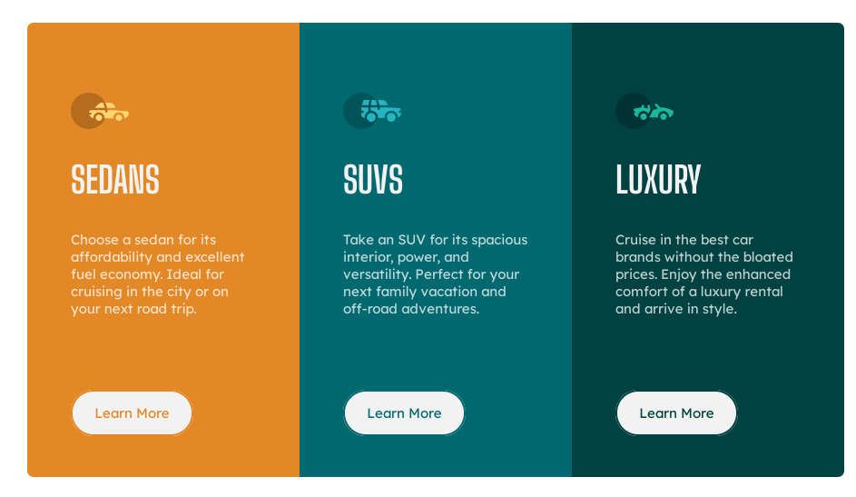

# Frontend Mentor - 3-column preview card component solution

This is a solution to the [3-column preview card component challenge on Frontend Mentor](https://www.frontendmentor.io/challenges/3column-preview-card-component-pH92eAR2-).

## Table of contents

- [Overview](#overview)
  - [The challenge](#the-challenge)
  - [Screenshot](#screenshot)
  - [Links](#links)
- [My process](#my-process)
  - [Built with](#built-with)
  - [What I learned](#what-i-learned)
  - [Continued development](#continued-development)
- [Author](#author)

## Overview

### The challenge

Users should be able to:

- View the optimal layout depending on their device's screen size
- See hover states for interactive elements

### Screenshot

### Links

- Solution URL: [https://www.frontendmentor.io/solutions/3columncard-scss-QWh2MJ_mM](https://www.frontendmentor.io/solutions/3columncard-scss-QWh2MJ_mM)
- Live Site URL: [https://lituanina.github.io/frontEndMentor/3ColPreviewCard/](https://lituanina.github.io/frontEndMentor/3ColPreviewCard/)

## My process

### Built with

- Semantic HTML5 markup
- SASS
- Mobile-first workflow

### What I learned

I've been reading up on and experimenting with organizing the code according to the principles of SMACSS.

### Continued development

I would like to learn more about SASS and SMACCS, and other principles such as BEM naming conventions in further projects.

## Author

- Frontend Mentor - [@lituanina](https://www.frontendmentor.io/profile/lituanina)
